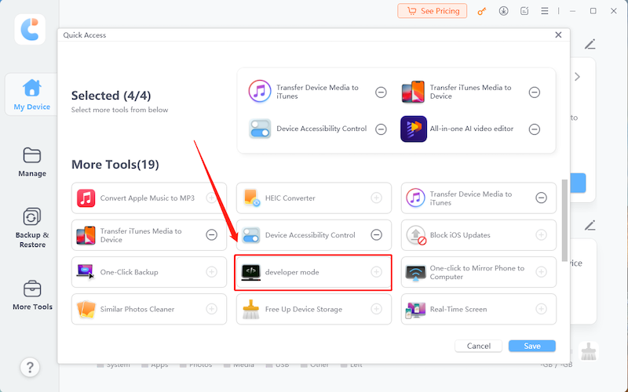

# Expo 개발자 설정 가이드

이 가이드에서는 개발자 프로필 설치, 개발자 모드 활성화, 미리보기(Preview) 빌드 설치를 포함하여 Expo 개발을 위해 iOS 기기를 설정하는 방법을 단계별로 안내합니다.

## 1단계: 개발자 프로필 설치

1.  다음과 같은 URL이 포함된 QR 코드를 이메일을 통해 받습니다:
    ```
    https://expo.dev/register-device/<uuid>
    ```
3.  iPhone 또는 iPad에서 링크를 엽니다(QR 코드를 스캔하거나 URL을 탭하세요).
4.  **"Download Profile"(프로필 다운로드)**을 탭합니다.
5.  기기의 **설정(Settings)** 앱으로 이동합니다.
6.  상단의 **"Profile Downloaded"(프로필이 다운로드됨)** 항목을 클릭합니다.
7.  **"Install"(설치)**을 탭하고 화면의 안내를 따릅니다.

## 2단계: 개발자 모드 활성화

1.  iPhone / iPad **설정(Settings)**을 엽니다.
2.  **개인정보 보호 및 보안(Privacy & Security)**으로 이동합니다.
3.  화면을 맨 아래로 스크롤하면 **개발자 모드(Developer Mode)** 옵션이 있습니다.
4.  해당 항목을 탭하고 스위치를 켜서 **ON**으로 설정합니다.
5.  **iPhone / iPad 재시동:** 설정을 확인하기 위해 시스템이 재시동을 요청합니다.
6.  **재시동 후 확인:** iPad가 다시 켜지고 잠금을 해제하면, "Turn on Developer Mode?(개발자 모드를 켜시겠습니까?)"라는 팝업이 나타납니다. **Turn On(켜기)**을 탭하고 기기 암호를 입력합니다.

> 혹시 설정에서 개발자 모드 옵션이 보이지 않는다면 아래를 참조하시가 바랍니다.
> 윈도우의 경우 확인하여보니, tenorshare의 [icarefone을](https://www.tenorshare.com/products/icarefone.html) 사용하여 언락할 수 있습니다.
> 무료 다운로드 하시어 실행하시면 아래와 같이 developer mode 툴을 확인하실 수 있는데, 클릭하시고 진행하시면 아래 이메일에서 말씀하신 것과 같이 Privacy & Security에서 개발자 모드를 확인할 수 있습니다



## 3단계: Preview 빌드 설치

1.  빌드 링크를 엽니다. 예시:
    ```
    https://expo.dev/accounts/deepeyes/projects/navien-serviceagent/builds/99446121-4763-40e6-ba1d-08fa63bbf183
    ```
2.  빌드 페이지에서 **"Install"(설치)** 또는 **"Download"(다운로드)**를 탭합니다.
3.  기기에서 앱 다운로드 및 설치가 시작됩니다.
4.  설치가 완료되면 홈 화면에서 앱을 확인할 수 있습니다.

> **성공:** 모든 준비가 완료되었습니다\! 이제 기기가 Expo 개발용으로 설정되었으며, 미리보기 빌드를 설치하고 테스트할 수 있습니다.
